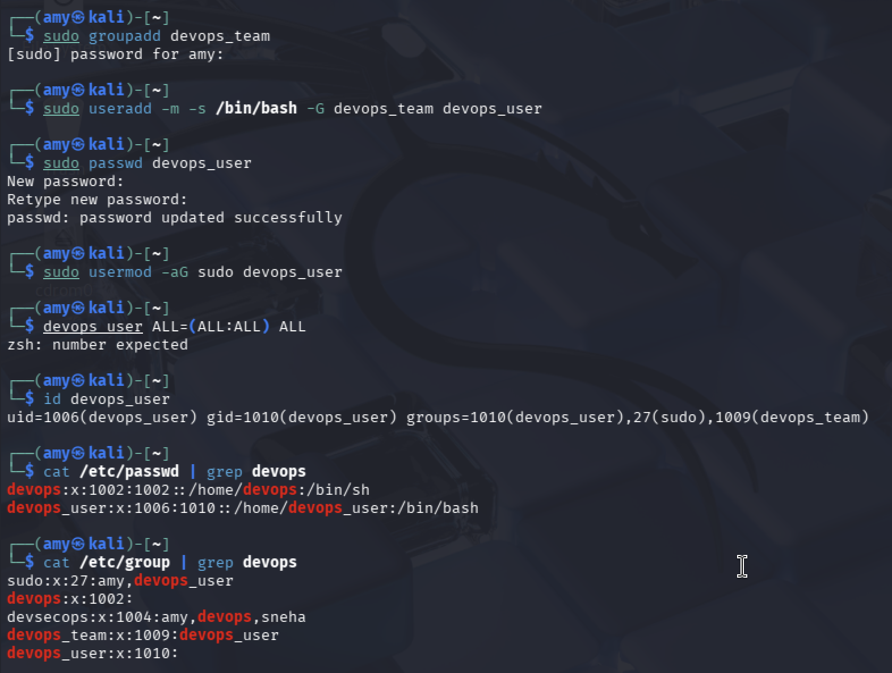

# 👤 Task 1: User & Group Management
### Week 2 — Linux System Administration & Automation

---

## Concept

Linux stores all user accounts in `/etc/passwd` and group memberships in `/etc/group`. Every file, process, and permission on the system ties back to a user and a group. Controlling these is the foundation of Linux security — especially on a shared or production server.

---

## Step 1: Create the Group

```bash
sudo groupadd devops_team
```

Verify it was created:
```bash
cat /etc/group | grep devops_team
```

**Sample output:**
```
devops_team:x:1002:
```
Format: `group_name : password : GID : members`

---

## Step 2: Create the User

```bash
sudo useradd -m -s /bin/bash -G devops_team devops_user
```

| Flag | Meaning |
|------|---------|
| `-m` | Create home directory at `/home/devops_user` |
| `-s /bin/bash` | Set bash as the login shell |
| `-G devops_team` | Add to `devops_team` as a supplementary group |

Set a password:
```bash
sudo passwd devops_user
```

**Sample output:**
```
New password:
Retype new password:
passwd: password updated successfully
```

---

## Step 3: Verify the User

```bash
id devops_user
```

**Sample output:**
```
uid=1001(devops_user) gid=1001(devops_user) groups=1001(devops_user),1002(devops_team)
```

```bash
cat /etc/passwd | grep devops_user
```

**Sample output:**
```
devops_user:x:1001:1001::/home/devops_user:/bin/bash
```
Format: `username : x(shadowed pw) : UID : GID : comment : home : shell`

---

## Step 4: Grant Sudo Access

```bash
sudo usermod -aG sudo devops_user
```

Verify:
```bash
groups devops_user
```

**Sample output:**
```
devops_user : devops_user devops_team sudo
```

---

## Step 5: Restrict SSH Login

```bash
sudo nano /etc/ssh/sshd_config
```

Add/edit these lines:
```
# Whitelist only specific users
AllowUsers devops_user ubuntu

# Block specific users
DenyUsers guest tempuser

# Disable direct root login
PermitRootLogin no

# Disable password auth (use SSH keys instead)
PasswordAuthentication no
```

Apply the changes:
```bash
sudo systemctl restart sshd
sudo systemctl status sshd
```

**Sample output:**
```
● ssh.service - OpenBSD Secure Shell server
     Active: active (running)
```

---

## Screenshot



---

## Security Best Practices

| Practice | Why It Matters |
|----------|----------------|
| Use `AllowUsers` over `DenyUsers` | Allowlist is safer — new accounts are blocked by default |
| Set `PermitRootLogin no` | Root SSH is the #1 brute-force target |
| Use `PasswordAuthentication no` | Eliminates password brute-force entirely |
| Audit `/etc/sudoers` regularly | Accumulated sudo grants are a common privilege escalation path |
| Lock unused accounts with `passwd -l` | Prevents login without deleting the account |
| Never edit `/etc/passwd` directly | Always use `useradd`/`usermod` — safer UID/GID handling |
