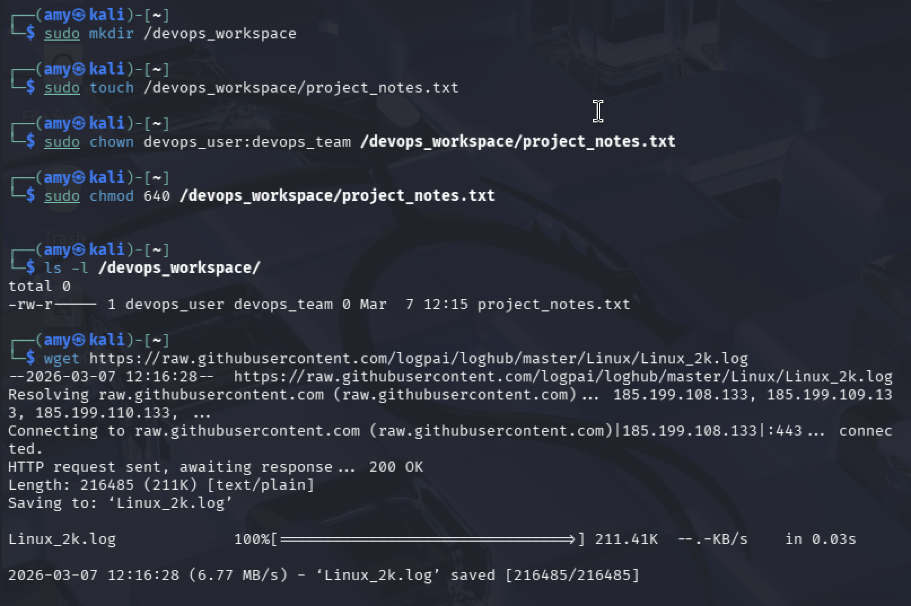

# 🔒 Task 2: File & Directory Permissions
### Week 2 — Linux System Administration & Automation

---

## Concept

Every file and directory in Linux has three permission sets: **Owner**, **Group**, and **Others**. Each set has three permission bits: **Read (r=4)**, **Write (w=2)**, **Execute (x=1)**. These are combined into an octal number — `chmod 640` means owner gets 6 (rw), group gets 4 (r), others get 0 (nothing).

```
Permission string breakdown:

- r w x  |  r - -  |  - - -
  Owner      Group     Others

- = file type (- for file, d for directory, l for symlink)
```

| Octal | Symbol | Meaning |
|-------|--------|---------|
| 7 | `rwx` | Read + Write + Execute |
| 6 | `rw-` | Read + Write only |
| 5 | `r-x` | Read + Execute only |
| 4 | `r--` | Read only |
| 0 | `---` | No access at all |

---

## Step 1: Create the Workspace Directory

```bash
sudo mkdir /devops_workspace
ls -ld /devops_workspace
```

**Sample output:**
```
drwxr-xr-x 2 root root 4096 Mar  7 20:15 /devops_workspace
```

---

## Step 2: Create the File

```bash
sudo touch /devops_workspace/project_notes.txt
```

---

## Step 3: Set Ownership

```bash
sudo chown devops_user:devops_team /devops_workspace/project_notes.txt
```

This sets:
- **Owner** → `devops_user`
- **Group** → `devops_team`

---

## Step 4: Set Permissions (640)

```bash
sudo chmod 640 /devops_workspace/project_notes.txt
```

What `640` means:
- `6` (rw-) → Owner (`devops_user`) can read and write
- `4` (r--) → Group (`devops_team`) can only read
- `0` (---) → Others have zero access

---

## Step 5: Verify with ls -l

```bash
ls -l /devops_workspace/
```

**Sample output:**
```
-rw-r----- 1 devops_user devops_team 0 Mar 7 20:15 project_notes.txt
```

Reading the output left to right:
```
-  rw-  r--  ---   1   devops_user  devops_team   0    Mar 7   project_notes.txt
^  ^^^  ^^^  ^^^
|  Owner Group Others
File type
```

---

## Additional Useful Permission Commands

```bash
# Set permissions on directory itself
sudo chmod 750 /devops_workspace

# Recursively apply permissions to all files inside
sudo chmod -R 640 /devops_workspace/

# Recursively change ownership
sudo chown -R devops_user:devops_team /devops_workspace/

# View permissions in octal format
stat -c "%a %n" /devops_workspace/project_notes.txt
```

**Sample output of stat:**
```
640 /devops_workspace/project_notes.txt
```

---

## Screenshot



---

## Security Best Practices

| Practice | Why It Matters |
|----------|----------------|
| Never use `chmod 777` on production files | Gives everyone read/write/execute — a serious security risk |
| Use `640` for sensitive config files | Owner edits, group reads, world sees nothing |
| Use `750` for directories you want to restrict | Group can enter and read, others cannot |
| Avoid running services as root | If the process is compromised, it owns everything |
| Use `umask 027` in profiles | Sets default permissions so new files are created as `640` automatically |
