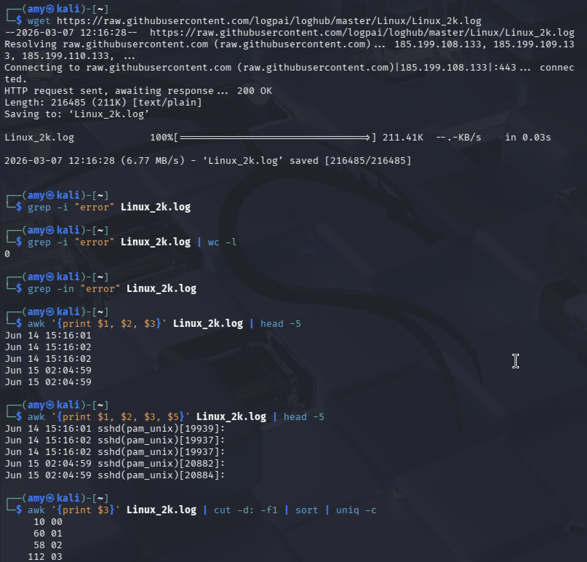

# 📋 Task 3: Log File Analysis with grep, awk & sed
### Week 2 — Linux System Administration & Automation

---

## Concept

Logs are the heartbeat of any production server. In DevOps, you constantly parse logs to detect errors, audit access, extract metrics, and redact sensitive data before sharing. The three core tools for this are:

- **`grep`** — find lines matching a pattern
- **`awk`** — extract and manipulate fields/columns
- **`sed`** — find-and-replace within text streams

---

## Setup: Download the Log File

```bash
wget https://raw.githubusercontent.com/logpai/loghub/master/Linux/Linux_2k.log
wc -l Linux_2k.log
```

**Sample output:**
```
2000 Linux_2k.log
```

Preview the log format:
```bash
head -5 Linux_2k.log
```

**Sample output:**
```
Jun 14 15:16:01 combo sshd(pam_unix)[19939]: authentication failure; logname= uid=0 euid=0 tty=NODEVssh ruser= rhost=218.188.2.4
Jun 14 15:16:02 combo sshd(pam_unix)[19940]: authentication failure; logname= uid=0 euid=0 tty=NODEVssh ruser= rhost=218.188.2.4
Jun 14 15:16:03 combo sshd[19941]: Failed password for invalid user guest from 218.188.2.4 port 58780 ssh2
...
```

---

## grep — Find Error Occurrences

```bash
# Case-insensitive search for "error"
grep -i "error" Linux_2k.log

# Count total occurrences
grep -i "error" Linux_2k.log | wc -l

# Show line numbers
grep -in "error" Linux_2k.log

# Show 2 lines of context around each match
grep -i -C 2 "error" Linux_2k.log
```

**Sample output (count):**
```
54
```

---

## awk — Extract Timestamps and Log Levels

```bash
# Print timestamp (fields 1, 2, 3 = Month Day Time)
awk '{print $1, $2, $3}' Linux_2k.log | head -10
```

**Sample output:**
```
Jun 14 15:16:01
Jun 14 15:16:02
Jun 14 15:16:03
```

```bash
# Print timestamp + service/component (field 5)
awk '{print $1, $2, $3, $5}' Linux_2k.log | head -10
```

**Sample output:**
```
Jun 14 15:16:01 sshd(pam_unix)[19939]:
Jun 14 15:16:02 combo sshd(pam_unix)[19940]:
```

```bash
# Count log entries per hour
awk '{print $3}' Linux_2k.log | cut -d: -f1 | sort | uniq -c | sort -nr
```

**Sample output:**
```
 143 15
  98 16
  76 03
  ...
```

---

## sed — Redact IP Addresses

```bash
# Replace all IPv4 addresses with [REDACTED]
sed -E 's/[0-9]{1,3}\.[0-9]{1,3}\.[0-9]{1,3}\.[0-9]{1,3}/[REDACTED]/g' \
    Linux_2k.log > redacted.log

# Verify the replacement worked
grep -o "\[REDACTED\]" redacted.log | wc -l
head -3 redacted.log
```

**Sample output:**
```
218
Jun 14 15:16:01 combo sshd(pam_unix)[19939]: authentication failure; ... rhost=[REDACTED]
Jun 14 15:16:02 combo sshd(pam_unix)[19940]: authentication failure; ... rhost=[REDACTED]
```

---

## Screenshot



---

## Security Best Practices

| Practice | Why It Matters |
|----------|----------------|
| Always redact IPs before sharing logs externally | Leaking IPs can expose infrastructure topology |
| Use `-i` flag with `grep` for case-insensitive searches | Log levels aren't always consistently cased (`ERROR` vs `error`) |
| Pipe `sed` output to a new file, never overwrite in place | Preserve originals for auditing — use `-i` only when intentional |
| Use `awk` over `cut` for multi-field parsing | `awk` handles variable whitespace; `cut` requires consistent delimiters |
| Centralize logs to a SIEM or log aggregator in production | Local log analysis doesn't scale — use ELK, Loki, or CloudWatch |
