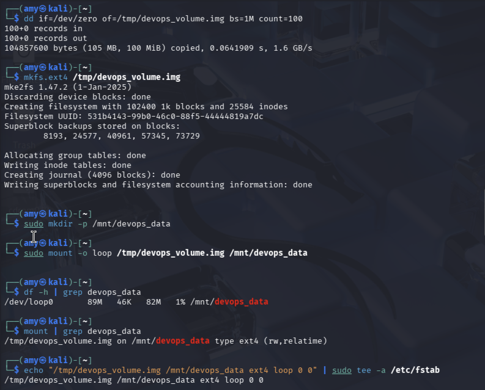

# 💾 Task 4: Volume Management & Disk Usage
### Week 2 — Linux System Administration & Automation

---

## Concept

In production, you attach external storage volumes to servers (like AWS EBS volumes to EC2). These need to be formatted with a filesystem and mounted to a directory before you can use them. For local practice, a **loop device** simulates this perfectly — it's a regular file that Linux treats as a block device.

---

## Step 1: Create the Mount Point

```bash
sudo mkdir -p /mnt/devops_data
ls -ld /mnt/devops_data
```

**Sample output:**
```
drwxr-xr-x 2 root root 4096 Mar 7 20:30 /mnt/devops_data
```

---

## Step 2: Create a Virtual Disk Image (Loop Device)

```bash
# Create a 100MB file filled with zeros — this is our "disk"
dd if=/dev/zero of=/tmp/devops_volume.img bs=1M count=100
```

**Sample output:**
```
100+0 records in
100+0 records out
104857600 bytes (105 MB, 100 MiB) copied, 0.412 s, 254 MB/s
```

---

## Step 3: Format the Image as ext4

```bash
mkfs.ext4 /tmp/devops_volume.img
```

**Sample output:**
```
mke2fs 1.46.5 (30-Dec-2021)
Discarding device blocks: done
Creating filesystem with 25600 4k blocks and 25600 inodes
...
Writing superblocks and filesystem accounting information: done
```

---

## Step 4: Mount the Loop Device

```bash
sudo mount -o loop /tmp/devops_volume.img /mnt/devops_data
```

---

## Step 5: Verify the Mount

```bash
df -h | grep devops_data
```

**Sample output:**
```
/dev/loop0       93M   24K   86M   1% /mnt/devops_data
```

```bash
mount | grep devops_data
```

**Sample output:**
```
/tmp/devops_volume.img on /mnt/devops_data type ext4 (rw,relatime)
```

---

## Step 6: Test Writing to the Volume

```bash
sudo touch /mnt/devops_data/test_file.txt
ls /mnt/devops_data/
df -h /mnt/devops_data
```

---

## Step 7: Make It Persist Across Reboots (fstab)

```bash
echo "/tmp/devops_volume.img /mnt/devops_data ext4 loop 0 0" | sudo tee -a /etc/fstab
cat /etc/fstab | tail -5
```

---

## Unmounting (cleanup)

```bash
sudo umount /mnt/devops_data
mount | grep devops_data   # should return nothing
```

---

## Screenshot



---

## Security Best Practices

| Practice | Why It Matters |
|----------|----------------|
| Always use `noexec` mount option for data volumes | Prevents executing binaries from that volume — limits malware spread |
| Use `nosuid` for non-system mounts | Prevents setuid binaries from running with elevated privileges |
| Monitor disk usage with `df -h` regularly | Full disks cause service crashes and log loss |
| Use separate volumes for `/var/log` and `/tmp` | Prevents log floods or temp file abuse from filling the root partition |
| Verify `fstab` entries with `mount -a` before rebooting | A bad `fstab` entry can make a server unbootable |
