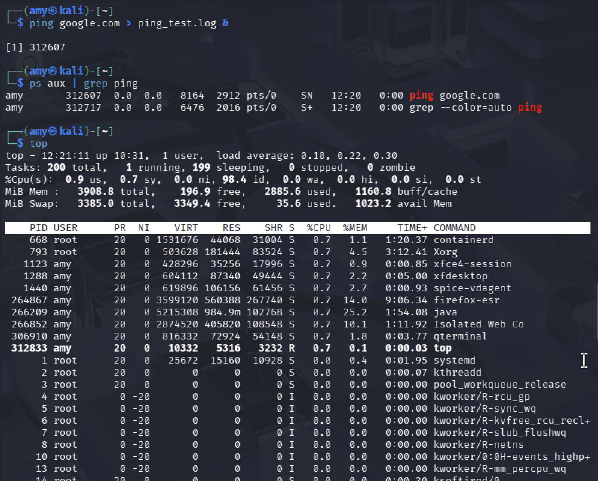

# ⚙️ Task 5: Process Management & Monitoring
### Week 2 — Linux System Administration & Automation

---

## Concept

Every running program on Linux is a **process** with a unique **PID** (Process ID). As a DevOps engineer, you need to start, monitor, and kill processes — especially background jobs. The three main tools are `ps` (snapshot), `top` (live view), and `htop` (interactive live view).

---

## Step 1: Start a Background Process

```bash
ping google.com > ping_test.log &
```

The `&` sends the process to the background. Linux prints the PID immediately:

**Sample output:**
```
[1] 14523
```

`[1]` = job number, `14523` = PID. Note this PID — you'll need it to kill the process.

---

## Step 2: Monitor with ps

```bash
# Snapshot of all processes
ps aux | grep ping
```

**Sample output:**
```
sneha    14523  0.0  0.0   7236  1024 pts/0   S    20:45   0:00 ping google.com
sneha    14531  0.0  0.0   6432   720 pts/0   S+   20:45   0:00 grep --color=auto ping
```

Key columns explained:

| Column | Meaning |
|--------|---------|
| `USER` | Who owns the process |
| `PID` | Process ID |
| `%CPU` | CPU usage percentage |
| `%MEM` | Memory usage percentage |
| `STAT` | Process state (S=sleeping, R=running, Z=zombie) |
| `COMMAND` | The command that started it |

---

## Step 3: Monitor with top

```bash
top
```

**Sample output (abbreviated):**
```
top - 20:46:01 up 2:13,  1 user,  load average: 0.00, 0.01, 0.00
Tasks: 112 total,   1 running, 111 sleeping
%Cpu(s):  0.3 us,  0.1 sy,  0.0 ni, 99.5 id
MiB Mem :   7872.0 total,   5421.3 free

  PID USER      PR  NI    VIRT    RES    SHR S  %CPU  %MEM     TIME+ COMMAND
14523 sneha     20   0    7236   1024    832 S   0.0   0.0   0:00.02 ping
```

Useful `top` keyboard shortcuts:
- `q` → quit
- `k` → kill a process (prompts for PID)
- `M` → sort by memory usage
- `P` → sort by CPU usage

---

## Step 4: Monitor with htop

```bash
# Install if not present
sudo apt install htop -y

htop
```

`htop` shows the same info as `top` but with color-coded CPU/memory bars, mouse support, and easier process killing (F9 to kill, F10 to quit).

---

## Step 5: Kill the Process

```bash
# Kill by PID (replace 14523 with your actual PID)
kill 14523

# If it doesn't respond to regular kill, force it:
kill -9 14523
```

**Verify it's gone:**
```bash
ps aux | grep ping
```

**Sample output:**
```
[1]+  Terminated    ping google.com > ping_test.log
sneha  14612  0.0  0.0  grep --color=auto ping
```

The `Terminated` message confirms it's dead.

---

## Step 6: Check What Was Logged

```bash
cat ping_test.log
```

**Sample output:**
```
PING google.com (142.250.195.46) 56(84) bytes of data.
64 bytes from bom12s01-in-f14.1e100.net: icmp_seq=1 ttl=118 time=12.4 ms
64 bytes from bom12s01-in-f14.1e100.net: icmp_seq=2 ttl=118 time=11.9 ms
...
```

---

## Screenshot



---

## Security Best Practices

| Practice | Why It Matters |
|----------|----------------|
| Regularly audit running processes with `ps aux` | Unknown processes can indicate malware or unauthorized services |
| Use `kill -9` sparingly | SIGKILL doesn't allow cleanup — prefer `kill` (SIGTERM) first |
| Monitor CPU/memory spikes with `top` | Sudden spikes often indicate a runaway process or an attack |
| Set resource limits with `ulimit` | Prevents a single process from consuming all system resources |
| Use `systemd` to manage long-running services | Services managed by systemd auto-restart on failure and log properly |
