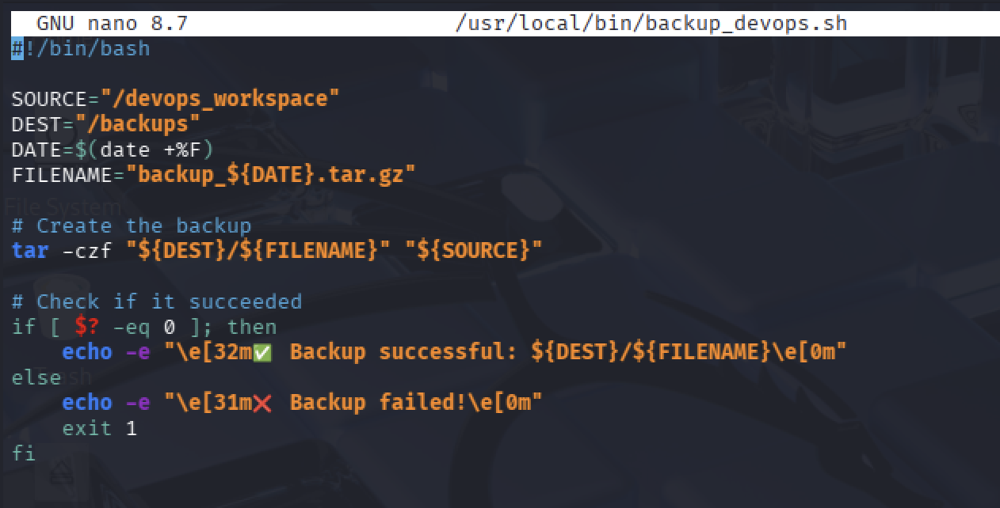

# 🔄 Task 6: Automate Backups with Shell Scripting & Cron
### Week 2 — Linux System Administration & Automation

---

## Concept

Manual backups fail — people forget, get busy, or make mistakes. In DevOps, backups are automated using **shell scripts** (the logic) and **cron** (the scheduler). A good backup script compresses the target, names the file with a timestamp, verifies success, and logs the result.

---

## Step 1: Create the Backup Directory

```bash
sudo mkdir -p /backups
sudo chown $USER:$USER /backups
ls -ld /backups
```

**Sample output:**
```
drwxr-xr-x 2 sneha sneha 4096 Mar 7 21:00 /backups
```

---

## Step 2: Write the Backup Script

```bash
sudo nano /usr/local/bin/backup_devops.sh
```

Paste the script content (see [scripts/backup_devops.sh](./scripts/backup_devops.sh)):

```bash
#!/bin/bash

SOURCE="/devops_workspace"
DEST="/backups"
DATE=$(date +%F)
FILENAME="backup_${DATE}.tar.gz"
LOGFILE="/var/log/backup_devops.log"

echo "[$(date '+%Y-%m-%d %H:%M:%S')] Starting backup of ${SOURCE}..." | tee -a "$LOGFILE"

# Create the backup archive
tar -czf "${DEST}/${FILENAME}" "${SOURCE}" 2>>"$LOGFILE"

# Check exit status
if [ $? -eq 0 ]; then
    SIZE=$(du -sh "${DEST}/${FILENAME}" | cut -f1)
    echo -e "\e[32m✅ Backup successful: ${DEST}/${FILENAME} (${SIZE})\e[0m" | tee -a "$LOGFILE"
else
    echo -e "\e[31m❌ Backup FAILED for ${SOURCE}\e[0m" | tee -a "$LOGFILE"
    exit 1
fi

# Remove backups older than 7 days
find "${DEST}" -name "backup_*.tar.gz" -mtime +7 -delete
echo "[$(date '+%Y-%m-%d %H:%M:%S')] Old backups cleaned up." | tee -a "$LOGFILE"
```

---

## Step 3: Make the Script Executable

```bash
sudo chmod +x /usr/local/bin/backup_devops.sh
```

---

## Step 4: Test It Manually

```bash
sudo /usr/local/bin/backup_devops.sh
```

**Sample output:**
```
[2025-03-07 21:05:12] Starting backup of /devops_workspace...
✅ Backup successful: /backups/backup_2025-03-07.tar.gz (4.0K)
[2025-03-07 21:05:12] Old backups cleaned up.
```

Verify the archive was created:
```bash
ls -lh /backups/
tar -tzf /backups/backup_$(date +%F).tar.gz   # list contents
```

**Sample output:**
```
-rw-r--r-- 1 root root 185 Mar  7 21:05 backup_2025-03-07.tar.gz

devops_workspace/
devops_workspace/project_notes.txt
```

---

## Step 5: Schedule with Cron

```bash
sudo crontab -e
```

Add this line to run every day at 2:00 AM:
```
0 2 * * * /usr/local/bin/backup_devops.sh >> /var/log/backup_devops.log 2>&1
```

Cron syntax breakdown:
```
┌─────────── minute (0–59)
│ ┌───────── hour (0–23)
│ │ ┌─────── day of month (1–31)
│ │ │ ┌───── month (1–12)
│ │ │ │ ┌─── day of week (0–7, 0 and 7 = Sunday)
│ │ │ │ │
0 2 * * *  /usr/local/bin/backup_devops.sh
```

**Verify cron is scheduled:**
```bash
sudo crontab -l
```

**Sample output:**
```
0 2 * * * /usr/local/bin/backup_devops.sh >> /var/log/backup_devops.log 2>&1
```

---

## Step 6: Check the Log

```bash
cat /var/log/backup_devops.log
```

---

## Screenshot



---

## Security Best Practices

| Practice | Why It Matters |
|----------|----------------|
| Always verify backup integrity with `tar -tzf` | A corrupt backup is worse than no backup — you won't know until you need it |
| Store backups on a separate volume or remote location | A disk failure wipes both the data and the backup if they're on the same disk |
| Auto-delete backups older than N days | Prevents disk from filling up silently |
| Log all backup runs with timestamps | Audit trail to confirm backups ran successfully |
| Test restores periodically | A backup you've never restored from is untested — run drills |
| Encrypt backups containing sensitive data | `gpg -c backup.tar.gz` before uploading to remote storage |
